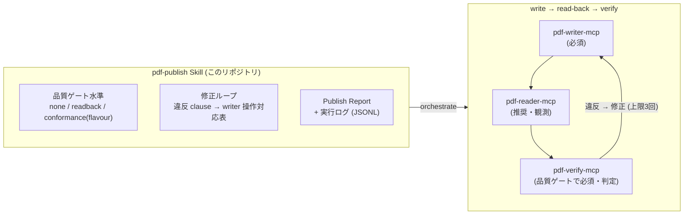

# pdf-publish-skill

[](https://opensource.org/licenses/MIT)
[](https://github.com/shuji-bonji/pdf-publish-skill)

🌐 [English version (README.md)](./README.md)

[PDF family](https://github.com/shuji-bonji#-pdf-family) の MCP サーバ群を編成して、PDF の**生成から納品までを品質ゲート付きで回す** **Claude Skill**。pdf-writer-mcp で書き、pdf-reader-mcp で読み戻し、pdf-verify-mcp（veraPDF）で機械採点する **write → read-back → verify ループ**を実行し、根拠付きの **Publish Report** を添えて納品します。

[pdf-trust-skill](https://github.com/shuji-bonji/pdf-trust-skill)（受け取った PDF を監査する）の**対**であり、こちらは「送り出す PDF を保証する」側です。

> **スコープ**: 本 Skill が保証するのは**構造・準拠性・抽出可能性**であって、文章内容の正しさではありません。合否判定は必ず pdf-verify-mcp（veraPDF 委譲）の結果を根拠とし、Skill 自身は判定しません。

## 何を提供するのか

このリポジトリは **MCP server ではなく Skill** です。ユーザーが「PDF/UA で作って」「品質保証付きで PDF 化して」と頼んだときに、Claude が PDF family の MCP を**どう組み合わせて使うか**をまとめた行動指針です。



### なぜ MCP ではなく Skill なのか

PDF family の設計原則は「**決定論的計算は MCP サーバ、手順・判断・知識は Skill**」。出力パイプラインは純粋なオーケストレーション（順序・ゲート水準・エラー分岐・報告）であり、実作業は writer / reader / verify が担います。

### 学習データ工場として

このループは PDF family の北極星（PDF 専門 LLM）の**学習データ工場**でもあります。verify の合否がラベルになるため、opt-in の実行ログ（JSONL）を残せます。違反があった実行こそ負例 + 修正列として価値があります。

## パイプラインの流れ

**要件確認 → 生成・編集 → 読み戻し → 品質ゲート → 修正ループ（上限 3 回）→ 納品** の 6 段階で、各段の判断基準を定めています。

貫いている規律は 4 つです。

- **合否を言うのは verify だけ** — writer の `warnings` は事実の報告、reader の観測は観測であって、どちらも判定ではありません
- **writer の正常終了を「要求どおり出力された」の証拠にしない** — 読み戻して入力と照合し、要求した機能（添付・しおり等）の実在を出力側で確認します
- **自己申告と第三者採点をペアで見る** — `identify_conformance`（XMP の宣言）と `validate_conformance`（veraPDF 採点）の**差分**が所見の本体です。既存 PDF の編集では入力も採点し、「元から壊れていた」と「自分が壊した」を分けます
- **「宣言」と「適合」を混同しない** — `ensure_pdfa` / `ensure_tagged` は XMP に `pdfaid` / `pdfuaid` を書く道具で、文書に「規格に沿っています」と**名乗らせる**だけです。適合させはしません。宣言を書いたら必ず対応する flavour を verify で測ります（測れないなら宣言も書きません）。**自分で宣言を書いた後の `identify_conformance` は合格の根拠になりません**

> **各段の具体的な手順・ツール名・分岐条件は [`skills/pdf-publish/SKILL.md`](./skills/pdf-publish/SKILL.md) が正典です。** README には再掲しません（乖離を防ぐため）。違反 clause → writer 操作の対応表は [`references/conformance-notes.md`](./skills/pdf-publish/references/conformance-notes.md)、エラーコード分岐は [`references/error-codes.md`](./skills/pdf-publish/references/error-codes.md)、レポートとログの様式は [`references/report-and-log.md`](./skills/pdf-publish/references/report-and-log.md) にあります。

## 前提 MCP

| MCP | 必須/任意 | 役割 |
|---|---|---|
| [@shuji-bonji/pdf-writer-mcp](https://github.com/shuji-bonji/pdf-writer-mcp) (v0.8.0+ / **v0.16.0+ 推奨**) | **必須** | 生成・編集・PDF/UA 修復。**PDF/A-3b の器付け（`ensure_pdfa`）は v0.15.0 から・PDF/A-4 / -4f と PDF 2.0 出力は v0.16.0 から** |
| [@shuji-bonji/pdf-verify-mcp](https://github.com/shuji-bonji/pdf-verify-mcp) (**v0.7.0+ 推奨**) | 品質ゲートで**必須** | 宣言の識別と veraPDF 委譲の準拠判定 |
| [@shuji-bonji/pdf-reader-mcp](https://github.com/shuji-bonji/pdf-reader-mcp) (**v0.9.1+ 推奨**) | 推奨 | 読み戻し（テキスト・論理順・フォント・タグの観測） |
| [@shuji-bonji/pdf-spec-mcp](https://github.com/shuji-bonji/pdf-spec-mcp) | 任意 | 違反時の ISO 条項引用。**ISO 19005（PDF/A）は収録外**なので PDF/A の条文は引けない |

`pdf-writer-mcp` は plugin の `dependencies` で宣言しているので、この Skill を install すると
**自動で一緒に入る**（Claude Code v2.1.110 以上）。

## インストール

- **Claude Code**: `/plugin marketplace add shuji-bonji/claude-plugins` → `/plugin install pdf-publish@shuji-bonji`
- **Cowork**: Settings → Capabilities → Skills でこのリポジトリの `.plugin`（Releases 参照）を追加
- **手動 clone**: `git clone https://github.com/shuji-bonji/pdf-publish-skill ~/.claude/skills/pdf-publish-skill`

## 構成

```
skills/pdf-publish/
├── SKILL.md                        # 本体（Phase 0〜5・判定表・やらないこと）
└── references/
    ├── error-codes.md              # writer 構造化エラー（code / next_actions）の分岐表
    ├── conformance-notes.md        # veraPDF 実測ノート + 違反 clause → 修正対応表
    └── report-and-log.md           # Publish Report テンプレ + 実行ログ (JSONL) 仕様
```

## 関連

- 上位仕様: [PDFfamily specs/07-pdf-publish-skill.md](https://github.com/shuji-bonji/Document-Note/blob/main/mcps/PDFfamily/specs/07-pdf-publish-skill.md)
- 対になる Skill: [pdf-trust-skill](https://github.com/shuji-bonji/pdf-trust-skill)（受入監査）

## ライセンス

MIT © shuji-bonji
