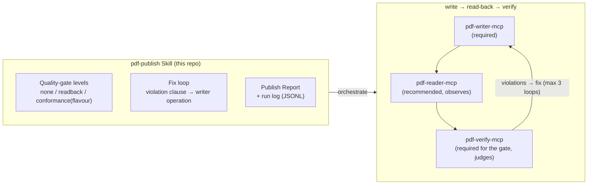

# pdf-publish-skill

[](https://opensource.org/licenses/MIT)
[](https://github.com/shuji-bonji/pdf-publish-skill)

🌐 [日本語版 (README.ja.md)](./README.ja.md)

A **Claude Skill** that orchestrates the [PDF family](https://github.com/shuji-bonji#-pdf-family) MCP servers to take a PDF **from generation to delivery through a quality gate**: write it with pdf-writer-mcp, read it back with pdf-reader-mcp, and machine-grade it with pdf-verify-mcp (veraPDF) — the **write → read-back → verify loop** — then deliver with an evidence-backed **Publish Report**.

The counterpart of [pdf-trust-skill](https://github.com/shuji-bonji/pdf-trust-skill) (which audits PDFs you *receive*); this one guarantees the PDFs you *send*.

> **Scope**: this skill guarantees **structure, conformance and extractability** — not the correctness of the prose. Pass/fail always comes from pdf-verify-mcp (delegating to veraPDF); the skill never judges on its own.

## What this provides

This repository is a **Skill, not an MCP server**: a Markdown playbook telling Claude how to combine the PDF family MCPs when a user asks for "an accessible PDF/UA document" or "a quality-assured PDF".



### Why a Skill, not an MCP

The family's design rule: **deterministic computation goes in MCP servers; procedure, judgement and knowledge go in Skills.** The output pipeline is pure orchestration — ordering, gate levels, error branching, reporting — while the real work is done by writer / reader / verify.

### As a training-data factory

The loop doubles as the data factory for the family's north star (a PDF-specialist LLM): verify's verdict is the label. An opt-in JSONL run log captures each execution; failed runs are the most valuable (negative example + fix sequence).

## Pipeline

Six stages — **requirements → write → read back → quality gate → fix loop (max 3) → deliver** — each with defined decision criteria.

Four rules run through all of them:

- **Only verify pronounces pass or fail.** The writer's `warnings` report facts and the reader's output is observation; neither is a verdict.
- **A clean exit from the writer is not evidence that the output contains what you asked for.** Read the result back, diff it against the input, and confirm that requested features (attachments, bookmarks) actually exist in the output.
- **Pair the self-declaration with the third-party score.** The gap between `identify_conformance` (the XMP claim) and `validate_conformance` (the veraPDF score) *is* the finding. When editing an existing PDF, score the input too, so "already broken" and "we broke it" stay distinguishable.
- **Never confuse a claim with conformance.** `ensure_pdfa` and `ensure_tagged` write `pdfaid` / `pdfuaid` into the XMP — they make a file *say* it follows a standard; they do not make it conform. Write a claim and you must measure the matching flavour with verify. If you cannot measure it, do not write the claim. (Corollary: `identify_conformance` is no evidence of a pass once you wrote the claim yourself.)

> **[`skills/pdf-publish/SKILL.md`](./skills/pdf-publish/SKILL.md) is authoritative for the per-stage procedure, tool names, and branch conditions.** They are deliberately not repeated here, so the two cannot drift apart. See also [`references/conformance-notes.md`](./skills/pdf-publish/references/conformance-notes.md) (violation → writer operation mapping), [`references/error-codes.md`](./skills/pdf-publish/references/error-codes.md), and [`references/report-and-log.md`](./skills/pdf-publish/references/report-and-log.md).

## Prerequisite MCPs

| MCP | Required? | Role |
|---|---|---|
| [@shuji-bonji/pdf-writer-mcp](https://github.com/shuji-bonji/pdf-writer-mcp) (v0.8.0+, **v0.14.0+ recommended**) | **Required** | create / edit / PDF/UA repair. **PDF/A-3b scaffolding (`ensure_pdfa`) landed in v0.15.0** |
| [@shuji-bonji/pdf-verify-mcp](https://github.com/shuji-bonji/pdf-verify-mcp) (**v0.7.0+ recommended**) | **Required** for the gate | declared conformance + verdicts via veraPDF |
| [@shuji-bonji/pdf-reader-mcp](https://github.com/shuji-bonji/pdf-reader-mcp) (**v0.9.1+ recommended**) | Recommended | read-back (text, logical order, fonts, tags) |
| [@shuji-bonji/pdf-spec-mcp](https://github.com/shuji-bonji/pdf-spec-mcp) | Optional | ISO clause citations on violations. **ISO 19005 (PDF/A) is outside its corpus**, so PDF/A clauses cannot be quoted |

## Installation

- **Claude Code**: `/plugin marketplace add shuji-bonji/claude-plugins` → `/plugin install pdf-publish@shuji-bonji`
- **Cowork**: add the `.plugin` from Releases via Settings → Capabilities → Skills
- **Manual clone**: `git clone https://github.com/shuji-bonji/pdf-publish-skill ~/.claude/skills/pdf-publish-skill`

## Layout

```
skills/pdf-publish/
├── SKILL.md                        # main playbook (phases 0–5, verdict table, non-goals)
└── references/
    ├── error-codes.md              # branching on writer's structured errors (code / next_actions)
    ├── conformance-notes.md        # veraPDF-measured pitfalls + violation→fix mapping
    └── report-and-log.md           # Publish Report template + JSONL run-log spec
```

## Related

- Upstream spec: [PDFfamily specs/07-pdf-publish-skill.md](https://github.com/shuji-bonji/Document-Note/blob/main/mcps/PDFfamily/specs/07-pdf-publish-skill.md)
- Counterpart skill: [pdf-trust-skill](https://github.com/shuji-bonji/pdf-trust-skill) (inbound audit)

## License

MIT © shuji-bonji
